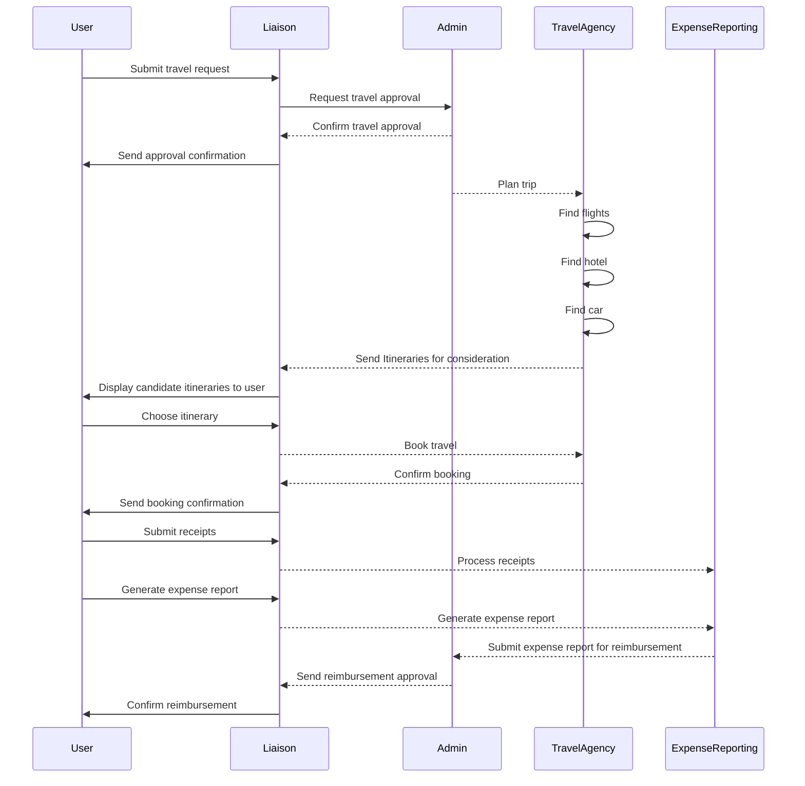

# Accede Concierge

_Earth's premiere Travel Booking and Expense reporting app_

## Basic workflow

```mermaid
sequenceDiagram
    participant User
    participant Liaison
    participant Admin
    participant TravelAgency
    participant ExpenseReporting

    User->>Liaison: Submit travel request
    Liaison->>Admin: Request travel approval
    Admin-->>Liaison: Confirm travel approval
    Liaison->>User: Send approval confirmation
    Admin-->>TravelAgency: Plan trip
    TravelAgency->>TravelAgency: Find flights
    TravelAgency->>TravelAgency: Find hotel
    TravelAgency->>TravelAgency: Find car
    TravelAgency-->>Liaison: Send Itineraries for consideration
    Liaison->>User: Display candidate itineraries to user
    User->>Liaison: Choose itinerary
    Liaison-->>TravelAgency: Book travel
    TravelAgency-->>Liaison: Confirm booking
    Liaison->>User: Send booking confirmation
    User->>Liaison: Submit receipts
    Liaison-->>ExpenseReporting: Process receipts
    User->>Liaison: Generate expense report
    Liaison-->>ExpenseReporting: Generate expense report
    ExpenseReporting-->>Admin: Submit expense report for reimbursement
    Admin-->>Liaison: Send reimbursement approval
    Liaison->>User: Confirm reimbursement
```
