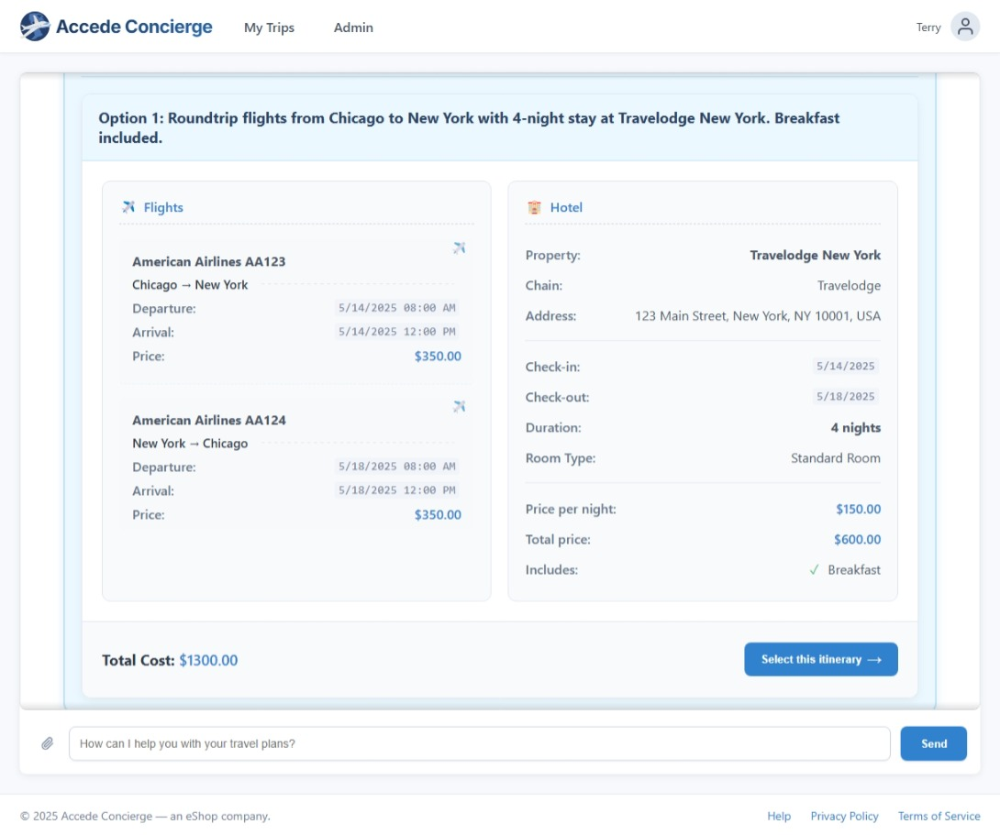
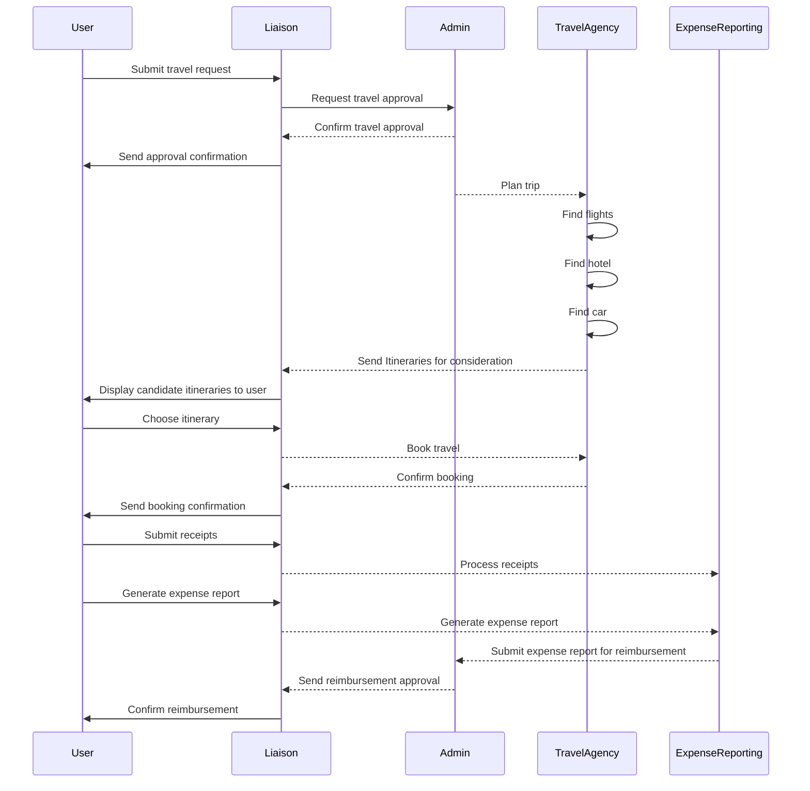

# Accede Concierge

_Earth's premiere Travel Booking and Expense reporting app_



## Features

* Multi-agent workflow
* Chat streaming
* Chat persistence
* Multi-model
* Multi-modal
* Agentic memory
* Human-In-The-Loop workflows (durable execution)
* Observability (logs, traces, metrics)
* Elastic scalability
* Fault tolerance
* Cloud-ready

## Prerequisites

- [.NET 9 SDK](https://dotnet.microsoft.com/en-us/download/dotnet/9.0)
- [Azure AI Foundry Project](https://learn.microsoft.com/en-us/azure/ai-foundry/how-to/create-projects?tabs=ai-studio)
- [Azure OpenAI Resource](https://learn.microsoft.com/en-us/azure/ai-services/openai/how-to/create-resource?pivots=web-portal)

## Setup

1. Extract the contents of the *Packages.zip* directory to the root directory. 

    ```
    |_ Packages
    |_ _src
        |_ ...
    |_ Packages.zip
    |_ ...
    ```

1. Navigate to the *_src/Accede.AppHost* project.
1. Set the following user secrets. i.e. `dotnet user-secrets set "AzureOpenAI:ResourceGroup" "YOUR-VALUE"`
    - **AzureOpenAI:ResourceGroup** - The name of your Azure Resource Group where the OpenAI Resource is deployed to
    - **AzureOpenAI:Name** - The name of your Azure OpenAI Resource
    - **AzureAIInference:Key** - Your Azure AI Inference Key
    - **AzureAIInference:Endpoint** - Your Azure AI Inference Endpoint (i.e. https://YOUR-FOUNDRY-AI-INFERENCE-ENDPOINT/models)
    - **Azure:SubscriptionId** - The subscription ID you deployed your resources to 
    - **Azure:ResourceGroup** - The name of your Azure OpenAI Resource is deployed to.
    - **Azure:Location** - The location you deployed your Azure OpenAI Resource to.
    - **Azure:AllowResourceGroupCreation**  - Set to *false* to use existing resource.

## Basic workflow


